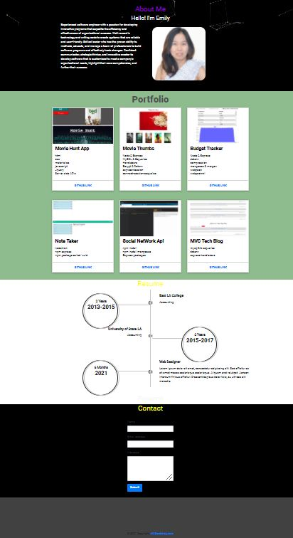

<h1 align="center">✌️🤟🙏👋  My React Portfolio  ✌️🤟🙏👋</h1>
<h1 align="center">

</h1>

## Description 

  *The what, why, and how:* 
  
  🔍 This is my Portfolio that I used my new React skill.  I want to share my projects not only applying for my jobs or working as a freelance, but also to share my work with fellow developers whose portfolios do not use the lastest technologies. 

 *Check out the [ExampleREADME.md](https://github.com/emilychhun/react-portfolio/blob/main/README.md) as an example.*
   
 
  ## Table of contents
  - [Description](#Description)
  - [Installation](#Installation)
  - [Usage](#Usage)
  - [Licence](#Licence)
  - [Contributors](#Contributors)
  - [Test](#Test)
  - [Repository Link](#Repository)
 
   

 ## Installation

  *Steps required to install project and how to get the development environment running:*
  
💽💽 The dependencies are necessary to be installed to be able to run the application To Run this application you are required to install react, bootstrap, react-dom, react-social-icons, web-vitals, react-particles.js, mdbreact, @fortawesome/fontawesome-svg-core, @fortawesome/free-solid-svg-icons, @fortawesome/react-fontawesome, @testing-library/react.

 
  
  
  ## Usage
  *Instructions and examples for use:*
  
1. Clone/Download the repo.
2. Run npm install.
3. Change the values in src/resumeData.js to suit your use-case.
4. Run npm start to spin the up the local dev server port 3000.(http://localhost:3000).
5. Make required changes in src/resumeData.js to suit your needs.
  
   *Demo*

  View a demonstration of the application:
   

  

   
  
  
 
 
  
  ## Licence
  📝📑
  
  
   
  
 
  ## Contributors
  💆🏽💆🏻‍♂️👳🏽👳🏽👳🏻‍♀️👨🏾‍🦽👨🏿‍🤝‍👨🏾As I use this for my own projects, i want to contribute to everybody such as students, my friends, and other users. I know this might not be the perfect README for all projects out there. If your vision of a perfect README.md differs greatly from mine, tell me what you think and we open an issue. If you'd like to contribute,  please do pull requests and make changes as you'd like. In this case, you can create a new file README-yourplatform.md and create the perfect boilerplate for that.
   
 
 
  ## Test
  🥇 *Tests for application and how to run them:*
 
   There is no test information for this application at this time.
   
 
  ## Questions
   

   *✋For any questions, please contact me with the information below:*
   

 Find me on GitHub: [emilychhun](https://github.com/emilychhun)
  

  Email me with any questions: emily_chhun23@yahoo.com
   

  Repo Link: [repo-link](https://github.com/emilychhun/react-portfolio)
  
   
  
